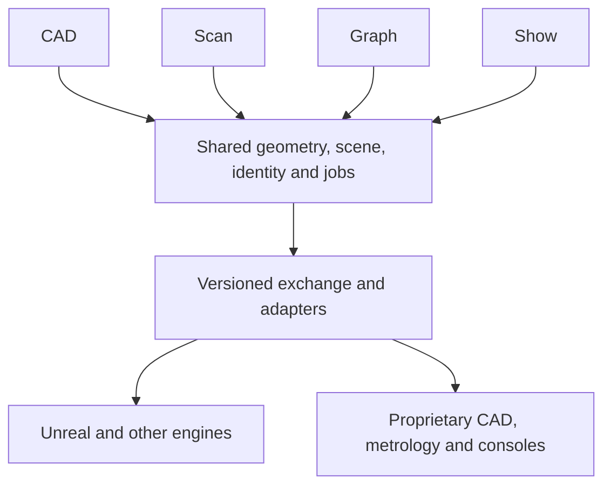

# BuilderCraft: CAD for themed entertainment

Decision date: 2026-10-07. This is the accepted product direction. App separation, new interchange and show systems described here are planned; the currently running alpha is the CADCraft-derived CAD desktop only.

## Four independent apps, shared contracts

| App (working designation) | Owns | Must also work independently |
|---|---|---|
| BuilderCraft CAD | Rhino-style direct NURBS/Brep modeling, drafting, layers and assembly/component/body browser; command coverage | Create/edit/save without the other apps or a Rhino license |
| BuilderCraft Scan | Mesh and point-cloud editing, smoothing, offset, shell, hole filling, repair, alignment, best fit and inspection inspired by GOM, PolyWorks and DesignX | Scan-to-mesh and mesh repair without CAD or Graph; optional external CAD reference |
| BuilderCraft Graph | Houdini-style procedural modeling and VFX with Grasshopper-style parametric data flow; kinematics, simulation, procedural scenery and engine handoff | Generate/evaluate/export without the CAD UI; import assets from external tools |
| BuilderCraft Show | Lightwright-style production database expanded to lighting, AV and mechanical/automation equipment; reports, patch, cue preparation and previs | Work on equipment and show data without geometry; connect to external CAD/visualizers/consoles |

Previs is shared functionality, available in app workspaces and through an optional standalone viewer. Do not require a fifth authoring app for the first useful walkthrough. These are executable and packaging boundaries, not four independent copies of the engine. One monorepo initially; separate dependency-light crates and independently installable frontends as they land. Existing `cadcraft` binary/package names remain until a deliberate migration.

## Shared ownership

| Service | Owns | Consumers |
|---|---|---|
| Geometry | Exact curve/surface/Brep topology, meshes, point clouds, tolerances, tessellation, geometric validation | CAD, Scan, Graph, scene export |
| Scene/document | Persistent object IDs, project/revision IDs, units, coordinate systems, hierarchy, layers, metadata, materials, asset references and provenance | Every app |
| Commands/jobs | Typed commands, validation, transactions, undo, cancellation, progress and capability discovery | UI, graphs, CLI, APIs, adapters |
| Graph evaluation | Typed ports, lists/data trees, scheduling, caching and explicit simulation state | Graph and embedded procedural panels |
| Show model | Device instances, profiles, patch, circuits, networks, equipment relationships, groups and cue intent | Show, CAD annotations, Graph, previs |
| Preview/render | Derived display/collision meshes, cameras, material mapping, instancing, LOD and timelines | Every app and optional viewer |
| Exchange | Versioned schemas, converters, diagnostics, loss reports, identity mapping and external app adapters | Every app |

One implementation per shared operation: the same offset/shell or curve projection command is callable from CAD, Graph and the API. Scan owns registration/inspection semantics; geometry primitives and validation stay reusable. No UI dependency below application layers. Persistence and command services must be available headlessly.

Exact CAD geometry and display geometry have distinct representations and revision links. A body can contain exact geometry and one or more derived meshes. Imported scans remain meshes/point clouds unless explicitly reconstructed; a closed mesh is not a Brep. Tessellation must not silently replace the authoritative design. Manufacturing, display and collision outputs use separate quality settings.

## Bridge and synchronization contract

First support portable file exchange, then local request/response and revisioned change subscriptions. Existing alpha loopback JSON lines/MCP is a starting point, not an implemented synchronization service.

Handshake: protocol/schema version, app and project IDs, supported operations and representation/format capabilities. Commands carry request IDs, document IDs and expected revisions. Changes carry stable object IDs, source app, revision, coordinate/unit metadata, operation and content hash. Source provenance is retained.

Use a single writer or an explicit per-object ownership lease for a connected session. Reject stale updates with conflict details; do not use last-writer-wins on geometry. Tag originating updates to prevent echo loops. Reconnect with a manifest comparison, then a resumable transfer. Remote object IDs are mapped, never assumed identical. Large geometry moves through bounded binary chunks or file-backed content-addressed assets, not repeated JSON arrays. Report unsupported fields and preserve untouched foreign data when the format permits.

Each app opens its own document independently. A live bridge is optional and replaceable by file exchange. Proprietary adapters run out of process and declare whether the host/license is required. Rhino, PolyWorks, DesignX, Vectorworks, Houdini, Autodesk hosts and consoles remain separately installed where an adapter needs them. Native core execution does not depend on these hosts. No project/model transmission to cloud services unless requested.

## Rhino command reconstruction

Rhino behavior is a functional reference for the independent CAD app. Implement from public behavior/specifications and original geometry algorithms. Do not copy proprietary code, icons or help text. A runtime Rhino adapter is a separate optional capability, not evidence of native command parity.

The documented Rhino 8 Windows/Mac inventory is under `docs/commands/`. Every command needs an owner, dependency sequence, API mapping, option coverage and verification status. `FlowAlongSrf` and `Project` are explicit priorities. Their implementation must cover UV/domain/orientation and direction/tolerance semantics, not merely produce a visually similar result. Classify commands by modeling, transformation, selection, analysis, display, file, UI or host-specific behavior. Rhino branding/license management functions get an explicit applicable replacement policy rather than fake geometry implementations.

Native core commands, UI aliases and scripting syntax are separate interfaces. Compatibility aliases dispatch the shared command engine; programmatic calls never open dialogs. A registered name does not mean the command works. Verification includes input/output geometry, supported options, units/tolerances, undo, failure preservation and example scenes. The live catalog should eventually show working, partial, unvalidated and not implemented commands with reasons.

## Procedural and immersive design

Graph combines Grasshopper lists/data trees, component parameters, reusable clusters, preview and bake with Houdini-style attribute streams, operator networks, staged geometry processing, simulation state, time evaluation and caches. Shared ports carry exact CAD, meshes, point clouds, attributes, signals, units, provenance, solver state and equipment references.

Expose existing engine commands as nodes. Distinguish pure evaluation from document mutations. Cycles are rejected except through explicit time/state nodes with bounded stepping. Bake is a revision-checked transaction; manual edits must have an explicit relationship to source graphs. Deterministic seeds, reproducible recipes and cheap previews are required. Cancellation discards incomplete results and leaves the last valid model available.

First engine milestone: massing or CAD scene to a navigable Unreal walkthrough with units, hierarchy, instances, materials, named objects, collision, spawn point and revision IDs. It must work before VFX or photorealistic work is complete. Start with GLB plus a semantic manifest and a tested Unreal import helper; retain CAD independently. Add OpenUSD for richer scene/animation composition and engine-specific adapters later. Datasmith is an optional evaluated adapter, not a promised native export. Other engines use the same scene boundary.

Lighting, AV, moving scenery, vehicle paths, cameras, audience routes and cue timelines should eventually be previewed together. Build kinematic motion and simple lighting/AV previews before volumetric effects, particles, fluids or expensive physical simulation. Support streaming subsets of large environments and low-detail massing. Material and lighting appearance are preview interpretations, not automatic photometric equivalence.

## StructureGraph relationship

Reuse StructureGraph's existing recipe staging, typed contracts, deterministic rail/frame concepts, provenance, output modes and fabrication validation. See `STRUCTUREGRAPH_REUSE.md`. Its current Rhino-authoritative backend remains valid inside StructureGraph; BuilderCraft adds an independent backend and an optional Rhino adapter. Do not rewrite StructureGraph's working repository rules or treat Rhino/Kangaroo dependencies as portable Rust code. Review actual sources and regression fixtures before extraction. Graph and direct CAD tools share these promoted operations.

## Rust resource ownership

Follow `MEMORY_AND_JOBS.md`. Ownership checking prevents many memory errors but does not prove bounded RAM, leak freedom, job cancellation, GPU cleanup or external adapter correctness. The current alpha has bounded individual NURBS inputs and a file-size limit; the full suite memory gate has not been passed.
